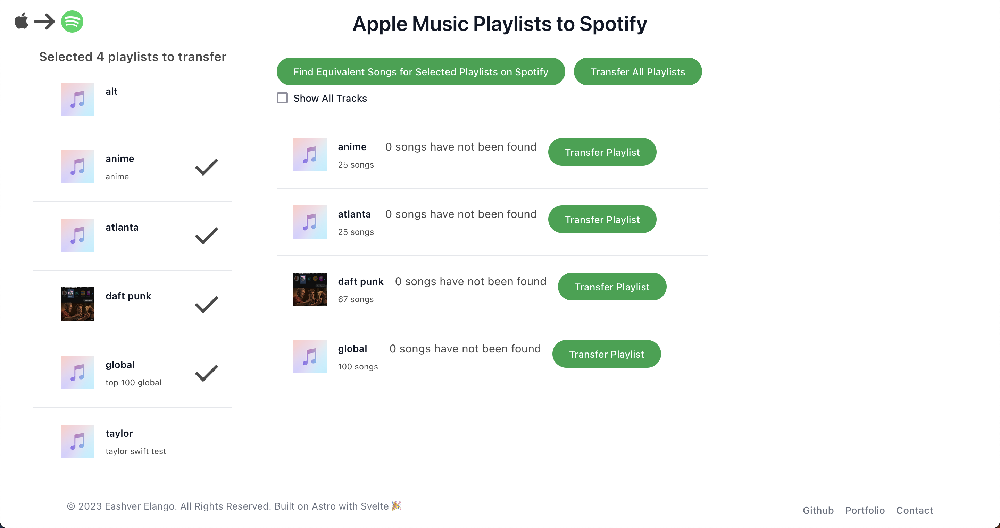

# Convert Apple Music Playlists to Spotify

Link: [Apple Music Playlists to Spotify](https://applemusictospotify.vercel.app)

A free app that does what it says.

If you encounter rate limiting, you can create your Spotify Development App (SDA) at [Spotify Developers](https://developer.spotify.com/).

When creating your SDA, add these two links as the redirect URI
- https://applemusictospotify.vercel.app
- https://applemusictospotify.vercel.app/

Replace `clientId` in `src/components/SpotifyButton.svelte` with your SDA's clientId

Run `npm install && npm run dev` in this project's root directory

## Images

Built on [Astro](https://astro.build/) with [Svelte](https://svelte.dev/).
Interfaces with both [MusicKit 3](https://developer.apple.com/musickit/) and the [Spotify Api](https://github.com/JMPerez/spotify-web-api-js)
